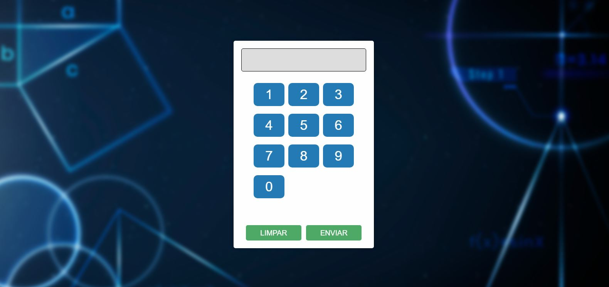
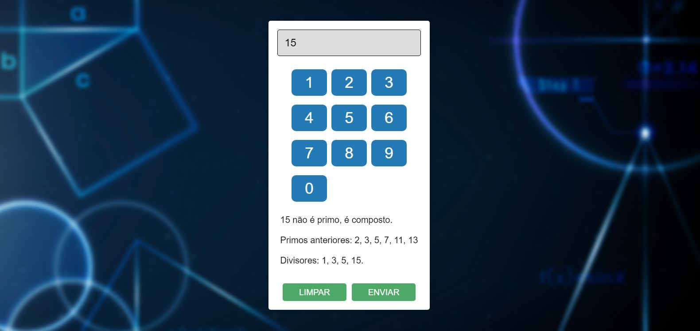
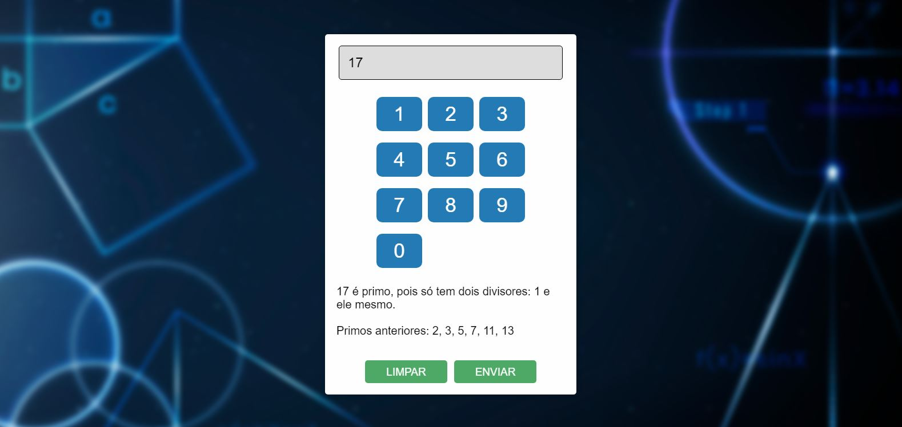

# Calculadora de Numeros Primos
Uma calculadora simples para verificar se um número é primo, fornecendo informações adicionais sobre os números primos anteriores e divisores em caso de números compostos.

# Imagens de Demonstração

  
   
  

# Como Usar
- Insira um número no campo de entrada.
- Utilize os botões numéricos para compor o número desejado.
- Clique no botão "ENVIAR" para processar e verificar se o número é primo.
- O resultado será exibido abaixo, indicando se o número é primo, composto, e fornecendo informações adicionais conforme apropriado.

# Funcionalidades
- Verifica se um número é primo.
- Fornece informações sobre números primos anteriores e divisores para números compostos.
- Botões numéricos facilitam a entrada de números.
- Opção de limpar o campo de entrada.
- Números acima de 10.000.000 costumam a demorar dependendo do desempenho da maquina.

# Estilo e Design
O design da calculadora é simples, elegante e responsivo. O plano de fundo possui uma textura suave, proporcionando uma aparência agradável.

# Personalização
Você pode personalizar o estilo da calculadora ajustando o arquivo de estilo [`style.css`](style.css)

Sinta-se à vontade para experimentar diferentes cores, fontes ou elementos de design para se adequar ao seu gosto e necessidades específicas.

# Contribuição
Se você tiver sugestões de melhorias ou encontrar problemas, sinta-se à vontade para enviar um pull request. Sua contribuição é bem-vinda!

## 👨‍💻 Desenvolvedor

Este projeto foi desenvolvido por **Alex Pablo de Oliveira Moraes**. 

Sou estudante de **Sistemas de Informação** na **UNEMAT**, apaixonado por tecnologia, programação e segurança de redes e tecnologias relacionadas ao desenvolvimento backend e segurança da informação.

Você pode me encontrar nas redes sociais ou conferir meus outros projetos no meu perfil [GitHub](https://github.com/AlexPablo-hub).

Se tiver alguma dúvida ou sugestão sobre o projeto, fique à vontade para entrar em contato!
